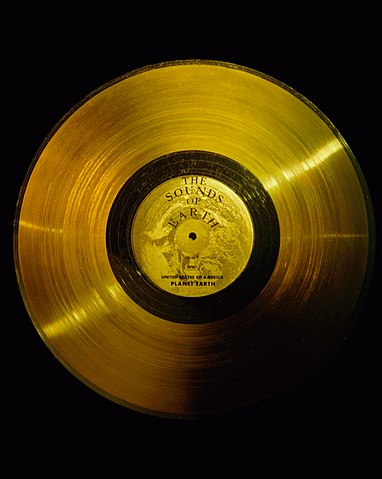

# Audio Snapshot Testing

<small>[Image source: Wikipedia](https://commons.wikimedia.org/wiki/File:The_Sounds_of_Earth_-_GPN-2000-001976.jpg)</small>

## What is snapshot testing?

Snapshot tests compare the **output of a previous known to be good** version
of a system with the **output of the current version** to protect against 
unintended changes.

Also known as *golden master testing* or *characterization testing*.

## What can be snapshot tested?

Anything :)

- DOM tree rendered by a React component
- Image generated on an HTML `<canvas>`
- Generated binary data in an `ArrayBuffer`
- Screenshot of a browser window or mobile app
- **Sound generated by Web Audio API**

## The snapshot testing workflow 

Set up the first snapshot

- Write a working implementation
- Save the output into a snapshot file

Make some changes to the implementation

- Compare the new output with the old one
- If the outputs are different,
  manually verify the **new** output (listen to it)
- If the new output sounds right (a change was intended),
  **overwrite** the saved snapshots
- Otherwise revert or fix the breaking changes

## Practical Audio Snapshot testing

The problem: snapshot testing frameworks exist but
no existing test framework supports **audio** snapshot testing.

"Tools" needed:

- Take an audio snapshot
- Allow saving the snapshot to a file
- Load the snapshot
- Compare snapshots for difference
- Manually verify snapshots

## Proof of concept audio snapshot testing

This repo contains the basics needed for audio snapshot testing. It is not a
fully elaborate framework, rather a draft implementation of an idea.

See the [the demo app](index.html) and the [test suite](test.html) running
in the browser. Browse [the source](./) to learn more about the details.

## Gotchas

Verifying audio data is not as easy as precisely comparing sample values.
For example there might be small differences in how browsers render web audio,
which can be tolerated for the given use case.

As there is no Web Audio API in Node.JS the test need to be run in real
browsers. [Karma test runner](http://karma-runner.github.io/latest/index.html)
and [Headless Chrome](https://chromium.googlesource.com/chromium/src/+/lkgr/headless/README.md)
are useful tools for automated testing.

It is also important to note that AudioContext and OfflineAudioContext are not
exactly the same, using the latter for testing might be problematic especially
when testing real-time operations on audio nodes.

## Further reading

- [Snapshot Testing: Use With Care][1] by Randy Coulman
- [What is Snapshot Testing?][2] on StackExchange (QA)
- [Jest Snapshot Testing][3]

[1]: http://randycoulman.com/blog/2016/09/06/snapshot-testing-use-with-care/
[2]: https://sqa.stackexchange.com/questions/29696/what-is-snapshot-testing
[3]: https://jestjs.io/docs/en/snapshot-testing.html
